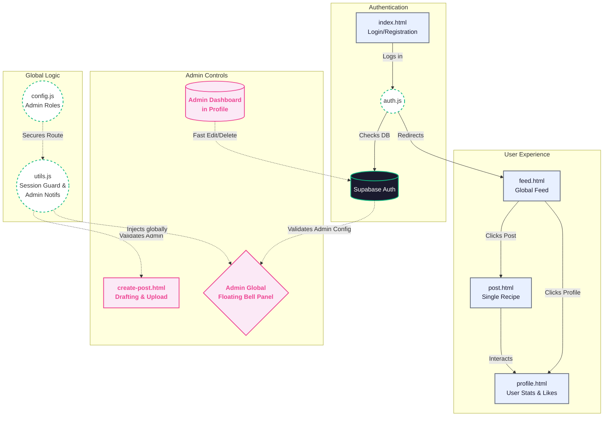

# HappyFoodHappySilvassa 🍔

A full-stack, real-time food blog web app powered by **Vanilla JavaScript, HTML/CSS**, and **Supabase**. Built to feel like a modern, scalable Single Page Application without any heavy front-end frameworks like React or Vue. 

It handles authentication, realtime feed fetching, nested commenting, optimistic like animations, drag-and-drop file chunking, and dynamic admin capabilities natively.

---

## ⚡️ Application Flowchart


---

## 🏗 Directory Structure & Code Review
The application operates on a clean separation of concerns:
- **`/*.html`**: Pure semantic views.
- **`/css/*.css`**: Modular stylesheets. Everything draws from `design-system.css` for consistent glassmorphism tokens, variables, buttons, inputs, and utilities.
- **`/js/*.js`**: Action controllers. Every `.js` file matches its `.html` view exactly, with `config.js` acting as the global state map, and `utils.js` serving as the global toolbelt (Toasts, Session Guards, Admin Injectables).

```
HappyFoodHappySilvassa_Version1/
├── index.html            // Login/Register Gate
├── feed.html             // Paginated/Filtered Feed View
├── post.html             // Single Recipe read interface
├── create-post.html      // Admin drag-and-drop authoring
├── profile.html          // User bookmarks / Admin Dashboard
│
├── css/
│   ├── design-system.css // Global Variables & Tokens
│   ├── auth.css          
│   ├── feed.css          
│   ├── post.css          
│   ├── create-post.css   
│   └── profile.css       
│
├── js/
│   ├── config.js         // Core Setup (Supabase Keys, Admin Email)
│   ├── utils.js          // Global Utilities (Toast, Navbar injection)
│   ├── auth.js           
│   ├── feed.js           
│   ├── post.js           
│   ├── create-post.js    
│   └── profile.js        
│
└── SQL Scripts/          // Supabase Database Architectures
    ├── supabase-setup.sql
    ├── supabase-day3.sql
    ├── supabase-day4-update.sql
    ├── supabase-admin-likes-fix.sql
    └── supabase-notifications.sql
```

---

## 💎 Features Implemented

### 1. Robust Authentication (`Day 1`)
- **Row Level Security (RLS)** is applied across tables, blocking unauthorized fetches.
- Includes a trigger that automatically mirrors new Auth Users into a public `profiles` table.
- Configured specifically to bypass email verification (for rapid local developer iterations).

### 2. The Global Feed (`Day 2`)
- Automatically paginates database fetches and maps them to frosted-glass cards.
- **Debounced Search Bar:** Filters directly against the Supabase Database based on text.
- Live Pills: Pre-mapped buttons to toggle sort by *Latest*, *Discussed*, and *Most Liked*.

### 3. Realtime Social System (`Day 3`)
- Fast, optimistic UI responses for Liked buttons (Heart bounce animations) mapped synchronously against an internal Supabase RPC atom counter.
- **Threaded Commenting**: Users can deploy and erase their own comments securely.
- **Admin Control Bypass**: Admins are structurally allowed to destroy any post, or remove any comment/like they deem inappropriate directly from the views.

### 4. Admin Post Creation (`Day 4`)
- Secure backend interface that guarantees only `CONFIG.adminEmail` can mount the page.
- **JS SessionStorage Cache**: Persists written drafts seamlessly across reloads.
- Complex file uploader implementing filetype tracking, chunk previews, and direct connection into Supabase Storage Buckets natively.

### 5. Profile & Notifications (`Day 5`)
- A unified Profile view executing heavy `INNER JOIN` SQL logic natively on the frontend to map a user's *Liked Posts* and *Own Comments*.
- **Live Activity Engine**: Added a native, floating Notification Bell that dynamically checks `admin_notifications` SQL View whenever tapped to report likes and comments to the admin smoothly.

---

## 🛠 Setup & Backend Requirements
This app runs completely entirely frontend in the browser! To guarantee all architecture aligns, run these scripts inside your Supabase Dashboard SQL Editor in order:
1. `supabase-setup.sql`: Base profiles and Auth triggers.
2. `supabase-day3.sql`: Posts, Likes, Comments schemas + Counter Logic RPCs.
3. `supabase-day4-update.sql`: Appends metadata columns (Tags, Timestamps)
4. `supabase-admin-likes-fix.sql`: Modifies RLS so Admins can enforce deletions across tables.
5. `supabase-notifications.sql`: Compiles a high-speed View intersecting tables to generate Activity Feeds. 

### Becoming Admin
Inside `js/config.js`, modify:
```js
adminEmail: 'satyamchoudharyfreefree@gmail.com',
adminPassword: 'YOUR_SECURE_PASSWORD'
```
Any user logged in matching this string natively gains the red Admin Dashboard and the Floating Notifications Bell.
